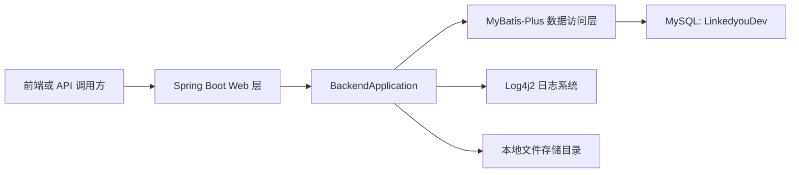
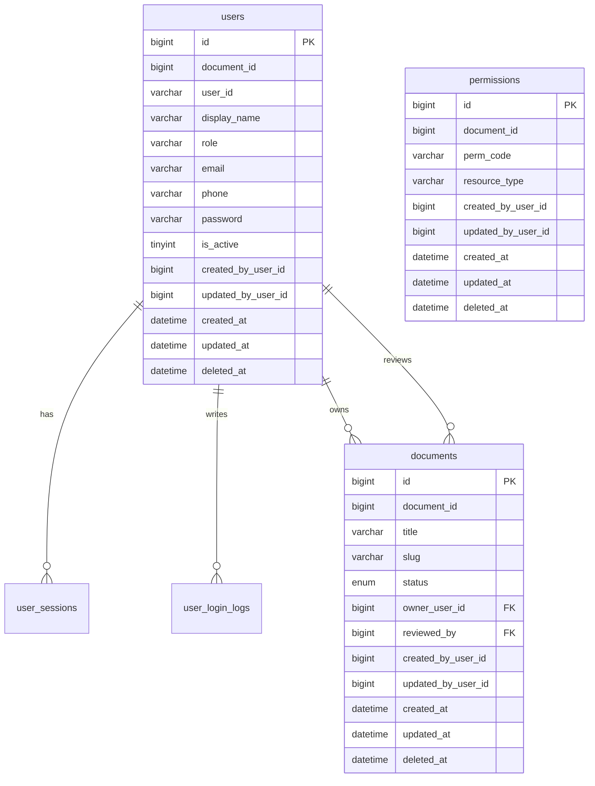

# 后端架构说明

本文档基于当前仓库已有代码、配置和数据库脚本整理，描述的是现有后端架构现状，不包含尚未落地到代码中的实现假设。

## 1. 项目定位

当前后端项目是 `LinkedYouBackEnd`，使用 Spring Boot 构建，目标是为 LinkedYou 系统提供后端 API、用户体系、认证会话和文档管理能力。

从现有文件看，项目已经完成基础工程骨架、运行配置、日志配置、数据库表设计、用户管理模块和文档管理模块。当前已形成 Controller、Service、Mapper、Entity、DTO、统一响应、异常处理和测试的基础闭环。

## 2. 技术栈

| 类别 | 当前选型 | 依据 |
| --- | --- | --- |
| 构建工具 | Maven | `pom.xml`、`mvnw` |
| 后端框架 | Spring Boot 3.5.6 | `spring-boot-starter-parent` |
| Java 版本 | Java 20 | `maven.compiler.source` / `target` |
| Web 框架 | Spring Web MVC | `spring-boot-starter-web` |
| 参数校验 | Spring Validation | `spring-boot-starter-validation` |
| AOP | Spring AOP | `spring-boot-starter-aop` |
| ORM / Mapper | MyBatis-Plus 3.5.7 | `mybatis-plus-spring-boot3-starter` |
| 数据库 | MySQL | `mysql-connector-j`、`application.yml` |
| 日志 | Log4j2 | `spring-boot-starter-log4j2`、`log4j2.xml` |
| 测试 | JUnit 5、Spring Boot Test | `spring-boot-starter-test`、`junit-jupiter` |

## 3. 目录结构

```text
.
├── db/
│   ├── 0000_init_all.sql
│   ├── 0001_users.sql
│   ├── 0003_permissions.sql
│   ├── 0006_user_sessions.sql
│   ├── 0007_user_login_logs.sql
│   ├── 0008_verification_codes.sql
│   └── 0009_documents.sql
├── logs/
│   └── app.log
├── src/
│   ├── main/
│   │   ├── java/com/linkedyou/backend/
│   │   │   └── BackendApplication.java
│   │   └── resources/
│   │       ├── application.properties
│   │       ├── application.yml
│   │       └── log4j2.xml
│   └── test/java/com/linkedyou/backend/
│       └── BackendApplicationTests.java
├── HELP.md
├── pom.xml
├── mvnw
└── mvnw.cmd
```

## 4. 运行时架构



当前代码中，`BackendApplication` 负责启动 Spring Boot 应用。用户、认证和文档 API 通过 `controller` 包暴露 REST 入口，业务规则集中在对应 Service，数据访问通过 MyBatis-Plus Mapper 完成。

## 5. 配置架构

### 5.1 应用配置

主要配置位于 `src/main/resources/application.yml`：

| 配置项 | 当前值或含义 |
| --- | --- |
| `spring.application.name` | `linkedyou` |
| `spring.datasource.url` | `jdbc:mysql://10.211.55.20:3306/LinkedyouDev` |
| `spring.datasource.username` | `root` |
| `spring.datasource.password` | `password` |
| `spring.datasource.driver-class-name` | `com.mysql.cj.jdbc.Driver` |
| `storage.local.root` | `/Users/hailinfan/data/docs` |
| `storage.local.max-file-size` | `50MB` |
| `app.cors.allowed-origins` | 允许本地前端 `localhost` / `127.0.0.1` 的 `5200`、`5173` 和 `3000` 端口 |
| `app.cors.allowed-headers` | `Content-Type`、`Authorization` |
| `app.cors.exposed-headers` | `Content-Disposition` |
| `mybatis-plus.global-config.db-config.id-type` | `AUTO` |

`application.properties` 中也设置了 `spring.application.name=backend`。由于 `application.yml` 和 `application.properties` 同时存在，应用名配置存在重复，实际生效结果取决于 Spring Boot 的配置加载和优先级。

### 5.2 数据源

当前数据源指向远程或虚拟机中的 MySQL：

```text
10.211.55.20:3306/LinkedyouDev
```

连接参数包含：

| 参数 | 作用 |
| --- | --- |
| `connectTimeout=5000` | 连接超时控制 |
| `socketTimeout=10000` | Socket 读写超时控制 |
| `tcpKeepAlive=true` | 开启 TCP KeepAlive |
| `allowPublicKeyRetrieval=true` | 允许获取公钥，常用于 MySQL 认证兼容 |
| `sslMode=DISABLED` / `useSSL=false` | 禁用 SSL |
| `serverTimezone=Asia/Tokyo` | 数据库时区 |
| `characterEncoding=utf8` | 字符编码 |

## 6. 日志架构

日志配置位于 `src/main/resources/log4j2.xml`。

当前日志输出包含两类 Appender：

| Appender | 输出位置 | 说明 |
| --- | --- | --- |
| `Console` | 控制台 | 标准输出 |
| `RollingFile` | `logs/app.log` | 按日期和大小滚动 |

文件日志滚动策略：

| 策略 | 当前值 |
| --- | --- |
| 时间滚动 | 每 1 天 |
| 大小滚动 | 10MB |
| 压缩格式 | `logs/app-%d{yyyy-MM-dd}-%i.log.gz` |
| Root 级别 | `info` |

## 7. 数据模型架构

当前数据库设计按用户、认证、权限和文档管理分组。数据库脚本已经拆分为每表一个 SQL 文件，并通过 `db/0000_init_all.sql` 按外键顺序统一初始化。按照当前架构约束，菜单由前端手动定义，后端不承担菜单配置、菜单授权或动态菜单下发职责。

当前 `db/0001_users.sql` 至 `db/0009_documents.sql` 定义的所有业务表均包含 `document_id`、`created_by_user_id`、`updated_by_user_id`、`created_at`、`updated_at`、`deleted_at` 通用字段。`document_id` 用于建立文档维度归属，`created_by_user_id` 和 `updated_by_user_id` 用于记录数据创建人与最后更新人，`deleted_at` 用于统一软删除语义。查询业务有效数据时应默认过滤 `deleted_at IS NULL`。



### 7.1 用户模块

脚本：`db/0001_users.sql`

核心表：`users`

主要能力：

| 能力 | 字段支撑 |
| --- | --- |
| 登录账号 | `user_id` |
| 用户展示信息 | `display_name`、`role` |
| 邮箱 / 手机唯一绑定 | `email`、`phone` |
| 密码认证 | `password` |
| 账号启停 | `is_active` |
| 登录失败锁定 | `failed_login_count`、`locked_until` |
| 登录轨迹 | `last_login_at`、`last_login_ip` |
| 文档归属和审计 | `document_id`、`created_by_user_id`、`updated_by_user_id` |
| 时间审计 | `created_at`、`updated_at` |
| 软删除 | `deleted_at` |

### 7.2 认证运行态模块

脚本：`db/0006_user_sessions.sql`、`db/0007_user_login_logs.sql`、`db/0008_verification_codes.sql`

核心表：

| 表 | 作用 |
| --- | --- |
| `user_sessions` | 登录会话、访问令牌、刷新令牌、设备信息、退出状态 |
| `user_login_logs` | 登录成功、失败、锁定、禁用等审计日志 |
| `verification_codes` | 注册、重置密码、登录、绑定等场景的验证码 |

该模块负责支撑登录态、Token 生命周期、设备识别、登录审计和验证码流程。当前已实现用户登录、登出、access token 刷新、会话写入、登录审计、连续失败计数和账号锁定；refresh token 轮换和验证码流程仍待补齐。三张运行态表同样包含 `document_id`、`created_by_user_id`、`updated_by_user_id`、`created_at`、`updated_at`、`deleted_at`，用于文档归属、审计追踪和软删除。

### 7.3 权限模块

脚本：`db/0003_permissions.sql`

核心表：

| 表 | 作用 |
| --- | --- |
| `permissions` | 权限点主表 |

权限编码示例在脚本注释中体现为 `system:user:read`，适合后续扩展为接口权限、按钮权限或数据权限。权限表包含 `document_id`、`created_by_user_id`、`updated_by_user_id`、`created_at`、`updated_at`、`deleted_at`，用于文档归属、审计追踪和软删除。

### 7.4 菜单边界说明

菜单在前端中手动定义，后端不处理菜单模块：

| 范围 | 当前约束 |
| --- | --- |
| 前端菜单定义 | 前端负责 |
| 前端路由配置 | 前端负责 |
| 菜单显示/隐藏 | 前端负责 |
| 动态菜单接口 | 后端不提供 |

因此，后续后端实现中不需要创建 `menu` 包、菜单 Controller、菜单 Service、菜单 Mapper、`menus` 表或 `role_menus` 表。若历史数据库中存在这两个表，`db/0000_init_all.sql` 会清理它们但不会重建。

### 7.5 文档管理模块

脚本：`db/0009_documents.sql`

核心表：`documents`

主要能力：

| 能力 | 字段支撑 |
| --- | --- |
| 文档元数据 | `title`、`slug`、`summary`、`category`、`tags` |
| 文档正文 | `content` |
| 生命周期 | `status`、`published_at`、`deleted_at` |
| 附件 | `file_path`、`file_size`，当前上传和读取接口只允许 PDF |
| 版本 | `version` |
| 所属人与审核人 | `owner_user_id`、`reviewed_by` |

当前已实现文档管理 API：

| 方法 | 路径 | 说明 |
| --- | --- | --- |
| `GET` | `/api/documents` | 查询未软删除文档列表，可按 `status` 过滤 |
| `GET` | `/api/documents/{id}` | 查询单个未软删除文档 |
| `GET` | `/api/documents/{id}/pdf` | 读取已上传 PDF，返回给前端 inline 展示 |
| `POST` | `/api/documents` | 创建草稿文档，校验未软删除文档中 `slug` 唯一 |
| `POST` | `/api/documents/upload` | 上传 PDF 并创建草稿文档，保存文件路径和大小 |
| `PUT` | `/api/documents/{id}` | 更新文档，传入字段按需更新并递增版本号 |
| `POST` | `/api/documents/{id}/publish` | 发布文档，记录审核人和发布时间 |
| `POST` | `/api/documents/{id}/archive` | 归档文档 |
| `DELETE` | `/api/documents/{id}` | 软删除文档，写入 `deleted_at` |

## 8. 模块边界

按照现有 SQL 和依赖，可以将后端拆分为以下业务边界：

| 模块 | 当前状态 | 主要职责 |
| --- | --- | --- |
| 应用启动模块 | 已有启动类 | 启动 Spring Boot 应用 |
| 基础配置模块 | 已有配置文件 | 应用名、数据源、本地存储、MyBatis-Plus、日志 |
| 用户模块 | 已有表设计、CRUD 代码、登录 API 和更改密码 API | 用户账号、账号状态、登录安全字段、用户增删改查、登录、密码变更 |
| 认证模块 | 已有表设计和登录业务代码 | 会话、Token、验证码、登录审计、失败锁定 |
| 文档模块 | 已有表设计和文档管理 API | 文档正文、PDF 上传读取、附件路径、发布、归档、审核和软删除 |
| API 层 | 已实现用户和文档 Controller | 所有 Controller 集中在 `controller` 包下，统一承接 HTTP API |
| 业务层 | 已实现用户、认证和文档 Service | Service、业务事务、规则校验 |
| 数据访问层 | 已实现用户、认证和文档 Mapper | MyBatis-Plus Mapper、实体映射 |

## 9. 建议的后续代码分层

基于当前包名 `com.linkedyou.backend`，后续可以按以下结构补齐业务代码：

```text
com.linkedyou.backend
├── BackendApplication.java
├── controller/
│   ├── UserController.java
│   ├── PermissionController.java
│   └── DocumentController.java
├── common/
│   ├── api/
│   ├── config/
│   ├── exception/
│   └── security/
├── user/
│   ├── service/
│   ├── mapper/
│   ├── entity/
│   └── dto/
├── auth/
└── document/
```

推荐原则：

| 原则 | 说明 |
| --- | --- |
| API 入口集中 | 所有 Controller 统一放在 `controller` 包下 |
| 用户相关 API 统一入口 | 用户管理、注册、登录、登出、刷新 Token、修改密码等接口都放在 `UserController` |
| 业务实现按模块组织 | 用户、认证、权限、文档分别维护 Service、Mapper、Entity、DTO；菜单留在前端 |
| Controller 只处理 HTTP 协议 | 只做参数接收、校验触发、调用 Service、返回结果，不直接写数据库逻辑 |
| Service 承担事务和业务规则 | 登录、授权、文档发布等规则集中在 Service |
| Mapper 只负责数据访问 | 使用 MyBatis-Plus BaseMapper 承载 CRUD |
| DTO 与 Entity 分离 | 防止数据库字段直接暴露给前端 |
| 统一响应和异常处理 | 已有基础 `ApiResponse` 和 `GlobalExceptionHandler` |

### 9.1 已实现用户管理 API

当前用户管理 API 已集中在 `com.linkedyou.backend.controller.UserController`：

| 方法 | 路径 | 说明 |
| --- | --- | --- |
| `GET` | `/api/users` | 查询未软删除用户列表 |
| `GET` | `/api/users/{id}` | 查询单个用户 |
| `POST` | `/api/users` | 创建用户，密码使用 BCrypt 哈希后写入 `password` |
| `POST` | `/api/users/login` | 用户登录，校验密码，写入会话和登录审计日志 |
| `POST` | `/api/users/refresh-token` | 使用 refresh token 刷新 access token，当前不轮换 refresh token |
| `POST` | `/api/users/logout` | 用户登出，撤销当前会话 |
| `PUT` | `/api/users/{id}` | 更新用户基础信息、启停状态或密码 |
| `PUT` | `/api/users/{id}/password` | 校验当前密码后更改密码，新密码按 `security.password-policy` 配置校验 |
| `DELETE` | `/api/users/{id}` | 软删除用户，写入 `deleted_at` |

用户 API 使用统一响应结构 `ApiResponse`。Controller 只负责 HTTP 入参、校验触发和响应封装，用户管理业务由 `UserManagementService` 承担，登录业务由 `AuthService` 承担，数据访问由 `UserMapper`、`UserSessionMapper` 和 `UserLoginLogMapper` 承担。登录成功会返回不透明 access token 和 refresh token；refresh token 在数据库中只保存 SHA-256 摘要。

### 9.2 已实现文档管理 API

当前文档管理 API 已集中在 `com.linkedyou.backend.controller.DocumentController`：

| 方法 | 路径 | 说明 |
| --- | --- | --- |
| `GET` | `/api/documents` | 查询未软删除文档列表，可按状态过滤 |
| `GET` | `/api/documents/{id}` | 查询单个文档 |
| `GET` | `/api/documents/{id}/pdf` | 读取 PDF 文件，返回 `application/pdf` 二进制内容 |
| `POST` | `/api/documents` | 创建草稿文档 |
| `POST` | `/api/documents/upload` | 上传 PDF 并创建草稿文档 |
| `PUT` | `/api/documents/{id}` | 更新文档并递增版本号 |
| `POST` | `/api/documents/{id}/publish` | 发布文档 |
| `POST` | `/api/documents/{id}/archive` | 归档文档 |
| `DELETE` | `/api/documents/{id}` | 软删除文档 |

文档 API 使用统一响应结构 `ApiResponse`。Controller 只负责 HTTP 入参、校验触发和响应封装，具体业务由 `DocumentManagementService` 承担，数据访问由 `DocumentMapper` 承担。文档删除使用 `deleted_at` 软删除；列表和详情默认过滤已软删除记录。上传接口使用 `multipart/form-data` 接收 PDF 文件和表单字段，文件保存到 `storage.local.root`，数据库写入失败时会清理已保存文件。PDF 读取接口校验文件路径必须位于 `storage.local.root` 下，并以 `inline` 方式返回 `application/pdf` 内容。

## 10. 测试现状

当前测试类：

```text
src/test/java/com/linkedyou/backend/BackendApplicationTests.java
src/test/java/com/linkedyou/backend/user/service/UserManagementServiceTest.java
src/test/java/com/linkedyou/backend/auth/service/AuthServiceTest.java
src/test/java/com/linkedyou/backend/controller/UserControllerTest.java
src/test/java/com/linkedyou/backend/document/service/DocumentManagementServiceTest.java
src/test/java/com/linkedyou/backend/controller/DocumentControllerTest.java
src/test/java/com/linkedyou/backend/common/config/CorsConfigTest.java
src/test/java/com/linkedyou/backend/common/logging/LayerLoggingAspectTest.java
```

已有测试内容：

| 测试 | 作用 |
| --- | --- |
| `contextLoads()` | 验证 Spring Boot 上下文可加载 |
| `createUserPersistsActiveUserWithHashedPassword()` | 验证创建用户时启用账号并使用 BCrypt 哈希密码 |
| `updateUserChangesOnlyProvidedFields()` | 验证更新用户时只修改请求中提供的字段 |
| `deleteUserSoftDeletesExistingUser()` | 验证删除用户时写入 `deleted_at` 做软删除 |
| `loginCreatesSessionLogAndResetsFailureStateWhenPasswordMatches()` | 验证登录成功时写入会话、审计日志并重置失败状态 |
| `loginIncrementsFailedCountAndLocksUserWhenPasswordIsInvalid()` | 验证密码错误时增加失败次数并达到阈值后锁定账号 |
| `createDocumentPersistsDraftWithSerializedTags()` | 验证创建文档时写入草稿状态并序列化标签 |
| `updateDocumentChangesProvidedFieldsAndIncrementsVersion()` | 验证更新文档时只修改请求字段并递增版本 |
| `publishDocumentSetsPublishedStatusReviewerAndTime()` | 验证发布文档时写入发布状态、审核人与发布时间 |
| `uploadPdfDocumentStoresFileAndPersistsDraftWithFormFields()` | 验证上传 PDF 时保存文件信息并写入草稿文档 |
| `openPdfLoadsStoredFileForActiveDocument()` | 验证文档 PDF 读取时按数据库文件路径加载文件 |
| `storePdfRejectsNonPdfContent()` | 验证非 PDF 内容被拒绝 |
| `deleteDocumentSoftDeletesExistingDocument()` | 验证删除文档时写入 `deleted_at` 做软删除 |
当前已覆盖 Spring Boot 上下文加载、用户管理、用户登录、用户登出、access token 刷新、文档管理、统一 CORS 配置和日志 AOP 的核心行为。后续 refresh token 轮换和接口鉴权落地后，应继续补充 Controller 层、Service 层和 Mapper 层测试。

## 11. 当前架构风险和待补齐项

| 类型 | 现状 | 建议 |
| --- | --- | --- |
| 业务 API | 已实现 `UserController` 和 `DocumentController`，接口鉴权待实现 | 继续补齐 token 校验和权限策略 |
| 数据访问 | 已实现用户、登录会话、登录日志和文档 Entity / Mapper，其它模块待实现 | 按 SQL 表结构继续生成权限、验证码相关实体和 Mapper |
| 认证安全 | 登录、登出、access token 刷新、会话写入和登录审计已实现。接口鉴权和 refresh token 轮换待补齐 | 后续增加 token 校验和 refresh token 轮换 |
| 配置重复 | `application.yml` 与 `application.properties` 都配置了应用名 | 统一保留一个来源 |
| 配置可用性 | `spring.main.allow-bean-definition-overriding=true:` 形态不符合常见 YAML 写法 | 建议改为 `allow-bean-definition-overriding: true` |
| 敏感信息 | 数据库账号密码写在配置文件中 | 后续改为环境变量或 profile 配置 |
| 日志 | 已通过 AOP 覆盖 Controller 和 Service 入口、出口、异常日志 | 后续按敏感字段规则继续扩展脱敏 |
| CORS | 已通过 `CorsConfig` 对 `/api/**` 做统一跨域配置 | 生产环境应将 `app.cors.allowed-origins` 调整为正式前端域名 |
| 文件存储 | 已实现 PDF 上传到本地目录 | 后续按权限、下载、预览或对象存储需求扩展 |

## 12. 总结

当前后端是一个 Spring Boot + MyBatis-Plus + MySQL 的基础工程。工程层面已经具备 Web、校验、AOP、日志、数据库访问和测试依赖，数据库层面已经设计了用户、认证、权限和文档管理核心表。用户管理 CRUD、用户登录、更改密码 API、文档管理 CRUD、PDF 上传读取、文档发布归档 API 已落地，菜单由前端手动定义，不纳入当前后端职责。

从架构成熟度看，当前处于“数据库模型和工程基础已完成，用户、登录与文档业务域已落地”的阶段。下一步最自然的推进顺序是补齐接口鉴权和 refresh token 轮换，再按实际需求扩展权限策略。
