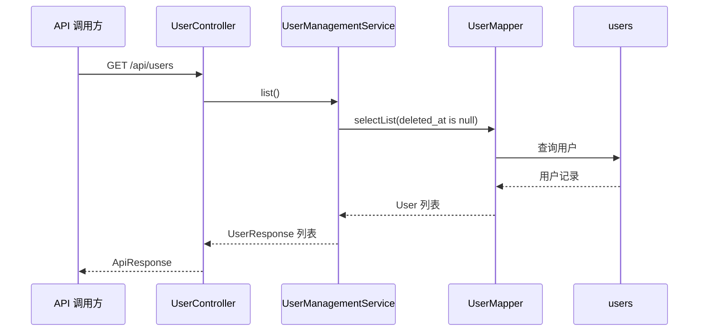
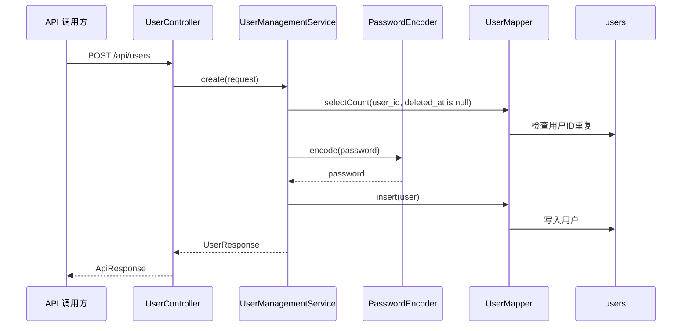
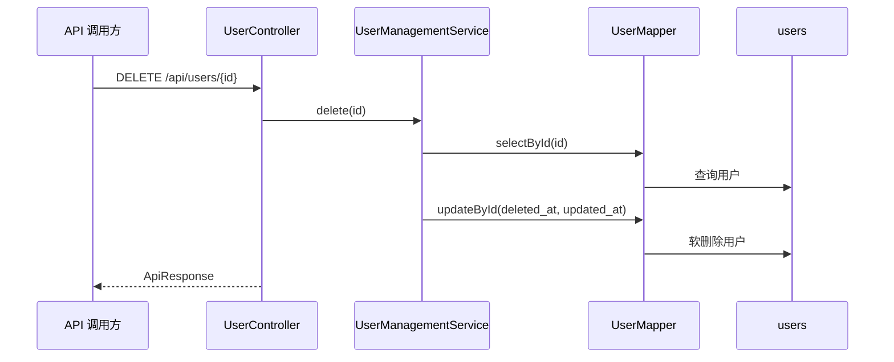

# 用户管理设计文档

本文档描述当前后端用户管理模块的设计。内容基于已经落地的代码和 `users` 表结构，不包含菜单管理或完整接口鉴权流程。用户登录已由认证模块提供。

## 1. 目标

用户管理模块用于维护后台用户账号，提供基础增删改查能力，并为登录、权限、会话管理提供用户数据基础。

当前已实现范围：

| 能力 | 状态 |
| --- | --- |
| 查询用户列表 | 已实现 |
| 查询用户详情 | 已实现 |
| 创建用户 | 已实现 |
| 更新用户 | 已实现 |
| 删除用户 | 已实现，采用软删除 |
| 密码加密存储 | 已实现，使用 BCrypt |
| 登录认证 | 已实现，由 `UserController` 调用 `AuthService` |

## 2. 架构约束

用户管理遵循当前后端架构约束：

| 约束 | 说明 |
| --- | --- |
| API 集中 | 所有 HTTP API 入口集中在 `com.linkedyou.backend.controller` |
| 用户相关 API 统一入口 | 用户管理、注册、登录、登出、刷新 Token、修改密码等用户相关接口统一放入 `UserController` |
| 业务逻辑下沉 | Controller 不直接写业务逻辑，不直接访问数据库 |
| 数据访问隔离 | MyBatis-Plus Mapper 只负责数据库访问 |
| 菜单不进后端 | 菜单和路由由前端手动定义，后端不处理菜单 |

## 3. 包结构

```text
com.linkedyou.backend
├── controller/
│   └── UserController.java
├── auth/
│   ├── dto/
│   │   ├── LoginRequest.java
│   │   └── LoginResponse.java
│   ├── entity/
│   │   ├── UserSession.java
│   │   └── UserLoginLog.java
│   ├── mapper/
│   │   ├── UserSessionMapper.java
│   │   └── UserLoginLogMapper.java
│   └── service/
│       ├── AuthProperties.java
│       ├── AuthService.java
│       ├── AuthServiceImpl.java
│       ├── AuthTokenGenerator.java
│       └── RandomAuthTokenGenerator.java
├── user/
│   ├── dto/
│   │   ├── UserCreateRequest.java
│   │   ├── UserUpdateRequest.java
│   │   ├── UserChangePasswordRequest.java
│   │   └── UserResponse.java
│   ├── entity/
│   │   └── User.java
│   ├── mapper/
│   │   └── UserMapper.java
│   └── service/
│       ├── password/
│       │   ├── PasswordPolicyProperties.java
│       │   └── PasswordPolicyValidator.java
│       ├── UserManagementService.java
│       └── UserManagementServiceImpl.java
└── common/
    ├── api/
    │   └── ApiResponse.java
    ├── config/
    │   └── PasswordConfig.java
    └── exception/
        ├── BusinessException.java
        └── GlobalExceptionHandler.java
```

## 4. API 设计

基础路径：

```text
/api/users
```

| 方法 | 路径 | Controller 方法 | 说明 |
| --- | --- | --- | --- |
| `GET` | `/api/users` | `list()` | 查询未软删除用户列表 |
| `GET` | `/api/users/{id}` | `getById(Long id)` | 查询用户详情 |
| `POST` | `/api/users` | `create(UserCreateRequest request)` | 创建用户 |
| `POST` | `/api/users/login` | `login(LoginRequest request)` | 用户登录 |
| `POST` | `/api/users/refresh-token` | `refreshToken(RefreshTokenRequest request)` | 刷新 access token |
| `POST` | `/api/users/logout` | `logout(String authorizationHeader)` | 用户登出 |
| `PUT` | `/api/users/{id}` | `update(Long id, UserUpdateRequest request)` | 更新用户 |
| `PUT` | `/api/users/{id}/password` | `changePassword(Long id, UserChangePasswordRequest request)` | 更改用户密码 |
| `DELETE` | `/api/users/{id}` | `delete(Long id)` | 软删除用户 |

统一响应结构：

```json
{
  "success": true,
  "code": "OK",
  "message": "success",
  "data": {}
}
```

失败响应示例：

```json
{
  "success": false,
  "code": "USER_NOT_FOUND",
  "message": "user not found",
  "data": null
}
```

## 5. 数据模型

用户数据来源于 `users` 表。

| 字段 | 说明 | 当前用途 |
| --- | --- | --- |
| `id` | 主键 | 用户唯一标识 |
| `document_id` | 文档ID | 文档维度归属 |
| `user_id` | 登录用户ID | 创建、查询、更新、唯一性校验 |
| `display_name` | 显示名称 | 创建、查询、更新 |
| `role` | 用户角色 | 创建、查询、更新、登录响应 |
| `email` | 邮箱 | 创建、查询、更新 |
| `phone` | 手机号 | 创建、查询、更新 |
| `password` | 密码哈希 | 创建和修改密码时写入 BCrypt 结果 |
| `avatar` | 头像路径 | 创建、查询、更新 |
| `is_active` | 是否启用 | 创建、查询、更新 |
| `failed_login_count` | 连续登录失败次数 | 创建时初始化为 `0`，登录能力落地后使用 |
| `locked_until` | 锁定截止时间 | 预留给登录安全策略 |
| `password_changed_at` | 密码修改时间 | 创建和修改密码时更新 |
| `last_login_at` | 最后登录时间 | 预留给登录能力 |
| `last_login_ip` | 最后登录 IP | 预留给登录能力 |
| `created_by_user_id` | 创建者用户ID | 审计追踪 |
| `updated_by_user_id` | 更新者用户ID | 审计追踪 |
| `created_at` | 创建时间 | 创建时写入 |
| `updated_at` | 更新时间 | 创建、更新、删除时写入 |
| `deleted_at` | 软删除时间 | 删除时写入，查询时过滤 |

## 6. 分层职责

### 6.1 UserController

`UserController` 是用户相关 API 的统一 HTTP 入口。

职责：

| 职责 | 说明 |
| --- | --- |
| 路由声明 | 暴露 `/api/users` 相关接口 |
| 参数校验触发 | 使用 `@Valid`、`@PositiveOrZero` |
| 服务调用 | 调用 `UserManagementService` |
| 响应封装 | 使用 `ApiResponse` 返回统一结构 |

非职责：

| 非职责 | 说明 |
| --- | --- |
| 不直接访问数据库 | 数据访问交给 Mapper |
| 不写业务规则 | 业务规则交给 Service |
| 不处理菜单 | 菜单由前端维护 |

### 6.2 UserManagementService

`UserManagementService` 定义用户管理业务接口。

```java
List<UserResponse> list();
UserResponse getById(Long id);
UserResponse create(UserCreateRequest request);
UserResponse update(Long id, UserUpdateRequest request);
void changePassword(Long id, UserChangePasswordRequest request);
void delete(Long id);
```

### 6.3 UserManagementServiceImpl

`UserManagementServiceImpl` 承担核心业务规则：

| 规则 | 实现 |
| --- | --- |
| 查询只返回未软删除用户 | 查询条件包含 `deleted_at is null` |
| 用户不存在时抛业务异常 | 抛出 `BusinessException("USER_NOT_FOUND", "user not found")` |
| 用户ID唯一性校验 | 创建和修改用户ID时检查未软删除用户中是否重复 |
| 创建用户默认启用 | `active` 为空时默认 `true` |
| 密码规则校验 | 使用 `PasswordPolicyValidator` 按 `security.password-policy` 配置校验 |
| 密码不明文存储 | 使用 `PasswordEncoder` 生成 BCrypt 哈希 |
| 更改密码校验 | 先校验当前密码，再写入新密码哈希 |
| 删除采用软删除 | 写入 `deleted_at`，不物理删除 |

### 6.4 UserMapper

`UserMapper` 继承 MyBatis-Plus `BaseMapper<User>`，负责 `users` 表的基础 CRUD。

## 7. 请求与数据流

### 7.1 查询用户列表



### 7.2 创建用户



### 7.3 删除用户



## 8. 校验和异常

### 8.1 请求校验

| DTO | 字段 | 校验 |
| --- | --- | --- |
| `UserCreateRequest` | `userId` | 必填，最长 64 |
| `UserCreateRequest` | `password` | 必填，长度 8-100 |
| `UserCreateRequest` | `displayName` | 最长 100 |
| `UserCreateRequest` | `role` | 最长 100 |
| `UserCreateRequest` | `email` | 邮箱格式，最长 191 |
| `UserCreateRequest` | `phone` | 最长 32 |
| `UserCreateRequest` | `avatar` | 最长 255 |
| `UserUpdateRequest` | `role` | 如果传入，最长 100 |
| `UserUpdateRequest` | `password` | 如果传入，长度 8-100 |
| `UserUpdateRequest` | `email` | 如果传入，需符合邮箱格式 |
| `UserChangePasswordRequest` | `currentPassword` | 必填，最长 100 |
| `UserChangePasswordRequest` | `newPassword` | 必填，最长 100，并按 `security.password-policy` 校验 |
| `RefreshTokenRequest` | `refreshToken` | 必填，最长 512 |
| PathVariable | `id` | 大于等于 0 |

### 8.2 业务异常

| code | 场景 | HTTP 状态 |
| --- | --- | --- |
| `USER_NOT_FOUND` | 用户不存在或已软删除 | `400` |
| `USERNAME_EXISTS` | 用户ID已存在 | `400` |
| `CURRENT_PASSWORD_INVALID` | 当前密码不正确 | `400` |
| `PASSWORD_POLICY_VIOLATION` | 新密码不符合密码规则 | `400` |
| `VALIDATION_ERROR` | 参数校验失败 | `400` |
| `TOKEN_INVALID` | access token 或 refresh token 缺失、格式错误、已撤销或已过期 | `400` |
| `INTERNAL_ERROR` | 未捕获异常 | `500` |

异常由 `GlobalExceptionHandler` 统一转为 `ApiResponse`。

## 9. 安全设计

当前用户管理模块已经具备基础密码安全处理：

| 安全点 | 设计 |
| --- | --- |
| 密码存储 | 不保存明文密码，只保存 BCrypt 哈希 |
| 种子测试密码 | SQL 脚本中的测试用户统一明文密码为 `Password123!`，数据库 `password` 字段仍保存 BCrypt 哈希 |
| 密码规则 | 使用 Passay 按 `application.yml` 中 `security.password-policy` 配置校验，`enabled` 可控制是否启用 |
| 响应脱敏 | `UserResponse` 不包含 `password` |
| 删除策略 | 软删除，保留审计和关联数据基础 |
| 登录安全字段 | `failed_login_count`、`locked_until`、`last_login_at`、`last_login_ip` 已由登录模块使用 |

认证拦截、接口鉴权和 refresh token 轮换尚待补齐。当前已实现登录认证、登出、access token 刷新、会话写入和登录审计。后续扩展仍应将用户相关 HTTP 入口集中在 `UserController`。

## 10. 测试设计

当前测试类：

```text
src/test/java/com/linkedyou/backend/user/service/UserManagementServiceTest.java
src/test/java/com/linkedyou/backend/auth/service/AuthServiceTest.java
src/test/java/com/linkedyou/backend/controller/UserControllerTest.java
```

已覆盖行为：

| 测试 | 覆盖点 |
| --- | --- |
| `createUserPersistsActiveUserWithHashedPassword()` | 创建用户时默认启用，并使用 BCrypt 哈希密码 |
| `updateUserChangesOnlyProvidedFields()` | 更新用户时只修改请求中提供的字段 |
| `deleteUserSoftDeletesExistingUser()` | 删除用户时写入 `deleted_at` |
| `loginCreatesSessionLogAndResetsFailureStateWhenPasswordMatches()` | 登录成功时写入会话、登录日志并重置失败状态 |
| `loginIncrementsFailedCountAndLocksUserWhenPasswordIsInvalid()` | 登录密码错误时增加失败次数并按配置锁定账号 |
| `logoutRevokesActiveSession()` | 登出时撤销当前有效会话 |
| `refreshTokenRefreshesAccessTokenWithoutRotatingRefreshToken()` | 使用有效 refresh token 刷新 access token，且不轮换 refresh token |

同时，`BackendApplicationTests.contextLoads()` 验证新增 Bean 不破坏 Spring Boot 应用上下文加载。

## 11. 当前限制和后续扩展

| 限制 | 后续处理 |
| --- | --- |
| 查询列表未分页 | 后续增加分页参数和分页返回结构 |
| 尚未实现 refresh token 轮换 | 后续可在刷新 access token 时同时生成新 refresh token 并覆盖 `refresh_token_hash` |
| 尚未实现接口鉴权 | 后续结合认证模块和权限策略处理 |
| 邮箱和手机号唯一性依赖数据库约束 | 后续可在 Service 中增加更友好的重复校验 |
| 未记录用户操作审计 | 后续结合请求日志或审计日志模块扩展 |
| 未提供批量操作 | 当前不需要，避免过早扩展 |

## 12. 总结

用户管理模块当前已经形成 Controller、Service、Mapper、Entity、DTO 的完整基础闭环。API 入口集中在 `UserController`，用户管理业务规则集中在 `UserManagementServiceImpl`，登录业务规则集中在 `AuthServiceImpl`，数据库访问由 MyBatis-Plus Mapper 承担。

后续应优先补齐接口鉴权和 refresh token 轮换能力，并保持“用户相关 HTTP API 统一放入 `UserController`”这一约束不变。
