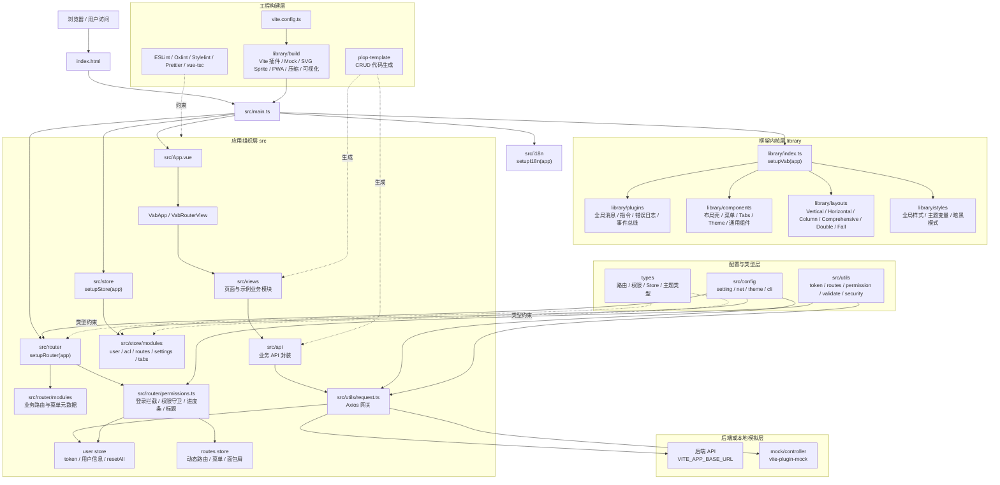
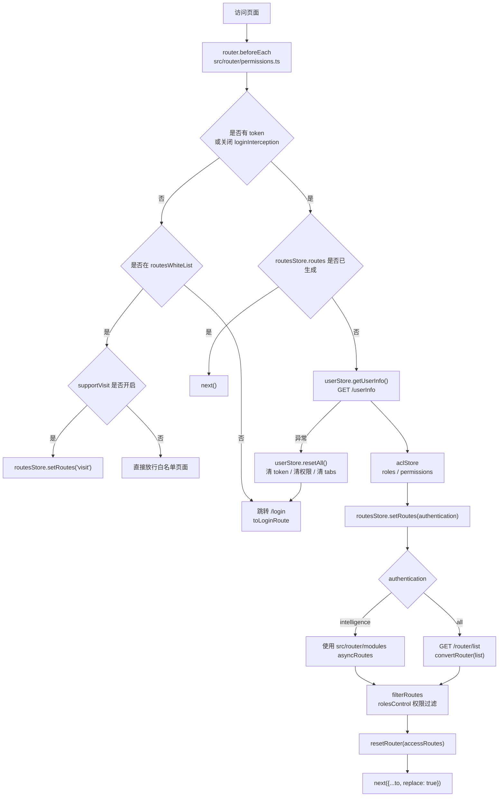

# 整体架构

## 目标

本框架用于快速构建中后台、大屏、门户和运营类前端应用。架构目标是让业务团队在统一的启动流程、路由协议、权限体系、请求规范、主题布局和工程质量门禁下开发模块，降低重复搭建成本。

## 当前技术栈

| 分类 | 当前实现 |
| --- | --- |
| 构建 | Vite |
| 框架 | Vue 3 |
| 语言 | TypeScript |
| 路由 | Vue Router |
| 状态 | Pinia |
| UI | Element Plus |
| 国际化 | vue-i18n |
| 请求 | Axios |
| Mock | vite-plugin-mock |
| 代码生成 | Plop |
| 质量工具 | ESLint、Oxlint、Stylelint、Prettier、vue-tsc |

## 启动流程

入口位于 `src/main.ts`，当前启动顺序如下：

1. `createApp(App)` 创建 Vue 应用。
2. `setupVab(app)` 安装框架插件、全局组件、全局样式。
3. `setupI18n(app)` 安装国际化。
4. `setupStore(app)` 安装 Pinia。
5. `setupRouter(app)` 安装路由和权限守卫。
6. `app.mount('#app')` 挂载应用。

`src/App.vue` 只渲染 `<vab-app />`，实际布局由 `library/components/VabApp`、`library/layouts` 和路由状态驱动。

## 总体架构图



## 启动与访问链路图

```mermaid
flowchart LR
  create["createApp(App)"] --> setupVabNode["setupVab<br/>全局插件 / 样式 / SVG / VabIcon / 右键菜单"]
  setupVabNode --> setupI18nNode["setupI18n<br/>语言包与国际化"]
  setupI18nNode --> setupStoreNode["setupStore<br/>安装 Pinia"]
  setupStoreNode --> setupRouterNode["setupRouter<br/>创建 Router / 添加路由 / 注册守卫"]
  setupRouterNode --> mount["app.mount('#app')"]
  mount --> vabApp["VabApp<br/>框架应用壳"]
  vabApp --> layout["library/layouts<br/>按 settings 和 route meta 选择布局"]
  layout --> routerView["VabRouterView"]
  routerView --> page["src/views 页面组件"]
  page --> apiCall["src/api 业务接口"]
  apiCall --> axiosGateway["src/utils/request.ts"]
  axiosGateway --> response["统一响应处理<br/>成功 code / 401 / 402 / 403 / 错误日志"]
```



## 认证与动态路由图



## 分层职责

| 层级 | 当前目录 | 职责 |
| --- | --- | --- |
| 应用入口 | `src/main.ts`、`src/App.vue` | 应用创建、插件安装、根组件挂载 |
| 业务层 | `src/views`、`src/api`、`src/router/modules` | 页面、业务接口、业务路由 |
| 状态层 | `src/store/modules` | 用户、权限、路由、标签页、主题等状态 |
| 框架层 | `library/components`、`library/layouts`、`library/plugins` | 布局、通用组件、全局插件、错误日志、指令 |
| 构建层 | `vite.config.ts`、`library/build` | Vite 插件、Mock、PWA、压缩、SVG Sprite |
| 类型层 | `types` | 路由、权限、主题、Store 等全局类型 |
| Mock 层 | `mock/controller` | 本地接口模拟 |

## 推荐框架化目录

当前模板可运行，但业务示例和框架内核混合较多。大规模应用建议逐步演进为：

```txt
src/
  app/                     # 应用启动、Provider、全局注册
  framework/               # 框架核心能力
    auth/
    request/
    router/
    store/
    layout/
    theme/
    i18n/
  modules/                 # 业务模块
  components/              # 项目级公共组件
  examples/                # 示例页，生产业务可移除
```

短期内可以不大规模搬迁文件，但新增业务模块应优先按 `docs/module-standard.md` 的规范组织，避免继续扩大 `src/views` 的扁平复杂度。

## 插件体系

`library/index.ts` 负责安装框架插件：

- `@vueuse/head`
- SVG Sprite 注册。
- `VabIcon`。
- 右键菜单组件。
- `library/plugins/*.ts` 下的插件。

当前插件包括全局消息、通知、弹窗、loading、事件总线、自定义指令、错误日志等。后续建议将插件改为显式配置，避免业务系统默认加载不需要的能力。

## 关键约束

- 框架层不能直接依赖具体业务模块。
- 业务模块可以依赖框架层组件、请求封装、权限工具和布局能力。
- 新增跨模块能力时，应优先放到 `library` 或未来的 `framework` 层。
- 示例能力必须可移除，不应成为启动必需依赖。
- 企业级项目应关闭生产 Mock，并补充 CI 中的 typecheck、lint、test、build。
